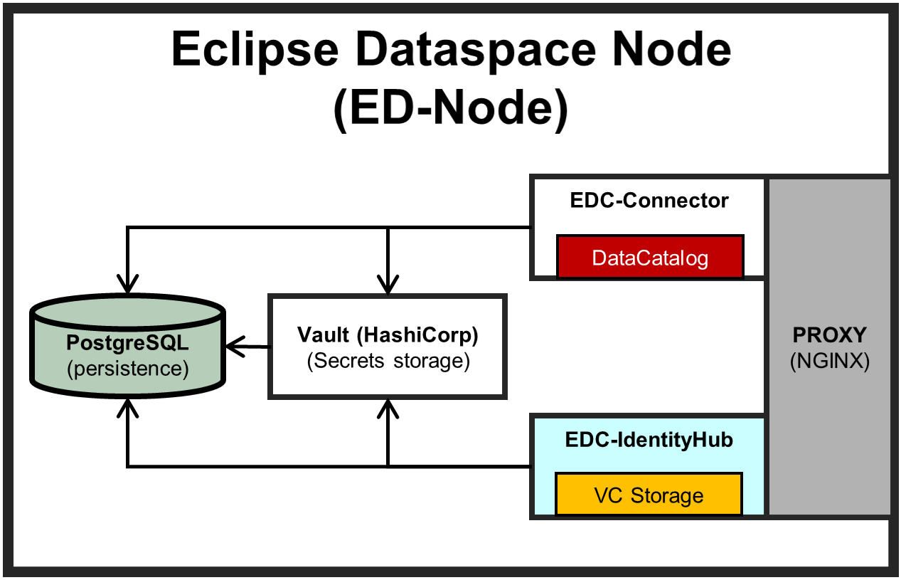
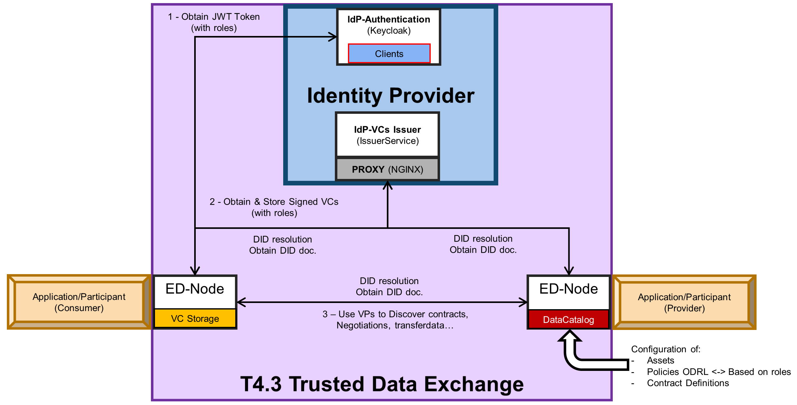
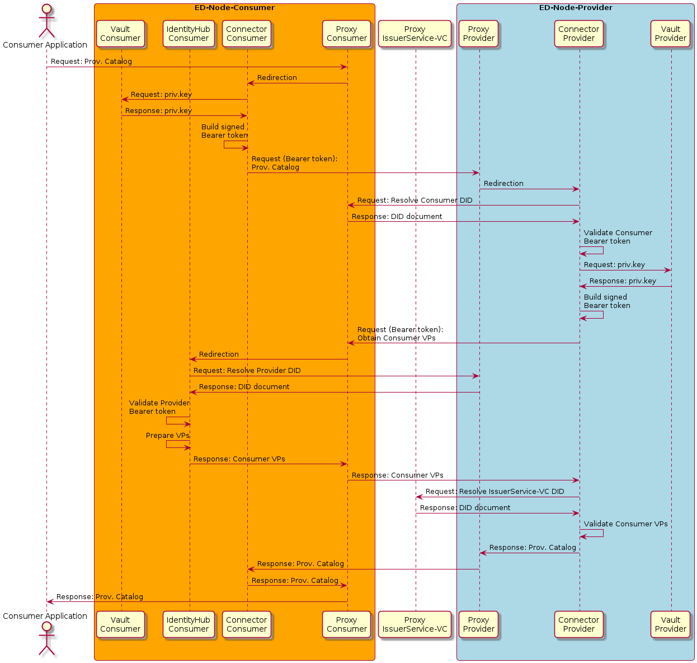

# ED-NODE - ARCHITECTURE & FLOW







# ED-NODE - Deployment Steps

## PREREQUISITES

1. A `Keycloak` instance must be running with a client assigned to the `ED-Node`. See the `README.md` file in the `./test/keycloak` folder. This folder provides a deployment of a Keyrock instance (based on Docker-Compose) for testing and a guide for creating a Keycloak Client. 

2. A `Issuer Service for Verifiable Credentials` (VCs) acquisition must be running. See the `README.md` file in the `./test/issuerservice-vc` folder. This folder provides of a development of an `issuerservice-vc` instance for testing.

#  0 - Configuration

- Duplicate `.env-template` to `.env-<instanceName>`

```sh
cp .env-template .env-<instanceName>
#For instance: cp .env-template .env-connector1
```

Where `<instanceName>` is the Instance Name of the `ED-Node` (`ED_NODE_INSTANCE_NAME` parameter of `.env-<instanceName>` file)

Define parameters of `.env-<instanceName>` file:

- `BASE_HOST`: Host
- `NGINX_PROTOCOL`: Protocol (http or https)
- `NGINX_EXPOSED_PORT`: Port (exposed port for NGINX - `ED-Node` gateway)
- `ED_NODE_INSTANCE_NAME`: `ED-Node` Identifier (contained by `ED-Node` DID)
- `UNIMAAS_ISSUERSERVICEVC_PROTOCOL`: IssuerService Protocol (http or https) (obtaining VCs)
- `UNIMAAS_ISSUERSERVICEVC_HOST`: IssuerService Host (obtaining VCs)
- `UNIMAAS_ISSUERSERVICEVC_DID_PORT`: IssuerService Port (obtaining VCs)
- `UNIMAAS_ISSUERSERVICEVC_NAME`: IssuerService Identifier (contained by IssuerService DID)
- `UNIMAAS_OIDC_IDP_PROTOCOL`: Keycloak Protocol (http or https) (obtaining JWT authenticantion)
- `UNIMAAS_OIDC_IDP_HOST`: Keycloak Host (obtaining JWT authenticantion)
- `UNIMAAS_OIDC_IDP_PORT`: Keycloak Port (obtaining JWT authenticantion)
- `UNIMAAS_OIDC_IDP_REALM`: Keycloak Realm (obtaining JWT authenticantion)
- `UNIMAAS_OIDC_IDP_CLIENT_ID`: Keycloak ClientID asigned to `ED-Node` (obtaining JWT authenticantion)
- `UNIMAAS_OIDC_IDP_CLIENT_SECRET`: Keycloak Client Secret  asigned to `ED-Node` (obtaining JWT authenticantion)
- `MOCKREGISTRY_CONTEXT_URL`: (OPTIONAL) Context server resolver for @context contained by VCs (if official online pages can't be accessed negotation steps does't work)

## 1 - Create Private/Public Key, DID & Vault Config File

To deploy the `ED-Node`, you must first create the private and public keys for the DID document. This folder offers a script (`generateEDNodeFiles-KeysDIDVault`) to generate test keys.

```sh
# Execution with proxy:
./generateEDNodeFiles-KeysDIDVault.sh <instanceName> <Host>:<NginxExposedPort>;
# ex (proxy): ./generateEDNodeFiles-KeysDIDVault.sh connector1 http://localhost:9876;

# Execution without proxy:
./generateEDNodeFiles-KeysDIDVault.sh <instanceName> <Host>:<NginxExposedPort> <edNodeCredServHost>:<edNodeCredServPort> <edNodeIdentityHost>:<edNodeIdentityPort> <edNodeDSPHost>:<edNodeDSPPort>;
# ex: ./generateEDNodeFiles-KeysDIDVault.sh connector1 http://localhost:9876 http://localhost:7191 http://localhost:7192 http://localhost:8192;
```

Where:

- <instanceName>: Instance name (see `ED_NODE_INSTANCE_NAME` parameter of `.env` file).
- <Host:NginxExposedPort>: host & port where DID related to the `ED-Node` can be resolved (`ED_NODE_DID_HOST`:`ED_NODE_DID_PORT`).
- <edNodeCredServHost:edNodeCredServPort>: host & port exposed by `ED-Node` to where `/api/credentials/` endpoints are accessible (see `IH_HOST` and `IH_CREDENTIALS_PORT` parameters of `.env` file). If you use NGINX redirects, you can specify the IP and port exposed by this component (`BASE_HOST`:`NGINX_EXPOSED_PORT`).
- <edNodeIdentityHost:edNodeIdentityPort>: host & port exposed by `ED-Node` to where `/api/identity` endpoints are accessible (see `IH_HOST` and `IH_IDENTITY_PORT` parameters of `.env` file).If you use NGINX redirects, you can specify the IP and port exposed by this component (`BASE_HOST`:`NGINX_EXPOSED_PORT`).
- <edNodeDSPHost:edNodeDSPPort>: host & port exposed by `ED-Node` to where `/api/dsp` endpoints are accessible (see `CONNECTOR_HOST` and `CONNECTOR_CALLBACK_PORT` parameters of `.env` file).If you use NGINX redirects, you can specify the IP and port exposed by this component (`BASE_HOST`:`NGINX_EXPOSED_PORT`).

Running the script should create two new folders, `assets` and `vault`, with the following contents:

```
deployment/assets/
├── dids/
│   ├── connector1/
│   │   └── .well-known/
│   │       └── did.json
└── keysPrivPub/
        └── connector1/
            ├── connector1_private.pem
            └── connector1_public.pem
deployment/vault/
     └── connector1/
        └── vault-connector1-config.json

```

# 2 - Deploy

Deploy `ED-Node` with:

```sh
./deploy.sh <instanceName> or ./deploy.sh <instanceName> build_up
#For instance: ./deploy.sh connector1
```

**NOTE:** For simulating `docker compose down -v` executes:
```sh
./deploy.sh <instanceName> down-v
#For instance: ./deploy.sh connector1 down-v
```

**NOTE:** For simulating `docker compose down -v; docker compose build; docker compose up -d` executes:
```sh
./deploy.sh <instanceName> fromzero
#For instance: ./deploy.sh connector1 fromzero
```
**NOTE:** For simulating `docker compose restart` executes:
```sh
./deploy.sh <instanceName> restart
#For instance: ./deploy.sh connector1 restart
```

**NOTE:** For simulating `docker compose stop` executes:
```sh
./deploy.sh <instanceName> stop
#For instance: ./deploy.sh connector1 stop
```

## 3 - Validation `ED-Node`

Deployed container:

- edc-proxy-<instanceName> --> RUNNING
- edc-postgres-<instanceName> --> RUNNING
- edc-vault-<instanceName> --> RUNNING
- edc-vault-init-<instanceName> --> Exited (0)
- edc-vault-autounseal-<instanceName> --> RUNNING
- edc-ih-<instanceName> --> RUNNING
- edc-ih-seed-<instanceName> --> Exited (0)
- edc-connector-<instanceName> --> RUNNING

Accessing to the IdentityHub LOGS:
```sh
docker compose --env-file .env-<instanceName> -f docker-compose-<instanceName>.yml logs -f ih-connector
#docker compose --env-file .env-connector1 -f docker-compose-connector1.yml logs -f ih-connector
```

Next information must be obtained (no errors and 2 credentials stored):
```
...
ih-connector1               | INFO 2025-09-19T12:58:02.69745306 64 service extensions started
ih-connector1               | INFO 2025-09-19T12:58:02.698246036 Runtime bc3e1d86-b6d4-4d50-812f-62e68ec09851 ready
ih-connector1               | WARNING 2025-09-19T12:58:05.829643521 [DidDocumentService] Updating DID documents after activating a KeyPair failed: Cannot publish DID 'did:web:*******%3A9876:connector1' for participant 'did:web:*******%3A9876:connector1' because the ParticipantContext state is not 'ACTIVATED', but 'CREATED'.
ih-connector1               | DEBUG 2025-09-19T12:58:06.706610404 [CredentialWatchdog] checking 2 credentials
```

Accessing to the Conector LOGS:
```sh
docker compose --env-file .env-<instanceName> -f docker-compose-<instanceName>.yml logs -f connector
#docker compose --env-file .env-connector1 -f docker-compose-connector1.yml logs -f connector
```
Next information must be obtained:
```
...
edc-connector-connector1    | INFO 2025-09-19T12:58:03.657159575 125 service extensions started
edc-connector-connector1    | INFO 2025-09-19T12:58:03.658233354 Runtime 8ffbda8f-ef59-49be-9438-6710f86bca75 ready
edc-connector-connector1    | DEBUG 2025-09-19T12:58:04.646835642 [DataPlaneSelectorManagerImpl] DataPlaneInstance 8ffbda8f-ef59-49be-9438-6710f86bca75 is now in state AVAILABLE
```

DID Resolution is working:

```sh
curl http://localhost:9876/connector1/.well-known/did.json
```

## 4 - Testing with other `ED-Nodes`

To demonstrate the data transfer flow between `ED-Nodes`, this section details how to deploy a new `ED-Node` (on the same machine). The procedure is the same as for the initial `ED-Node`:

- Create the new Keycloak client asigned to the new `ED-Node`.

- Duplicate `.env-template` to `.env-<instanceName>`

```sh
cp .env-template .env-<instanceName>
#For instance: cp .env-template .env-connector2
```

- Configure `.env-<instanceName>` file and change the next parameters:

    ```
    - `BASE_HOST`: the same as `ED-Node` of connector1 (if the same machine)
    - `NGINX_PROTOCOL`: the same as `ED-Node` of connector1 (if the same machine)
    - `NGINX_EXPOSED_PORT:9877`
    - `ED_NODE_INSTANCE_NAME:connector2` (new Instance Name).    
    ```

    - `Identity Provider (VCs): ISSUERSERVICE-VC`, `Identity Provider (Autentication): KeyCloack` and `Mock Registry` must be the same as configured for the first `ED-Node` instance (connector1), **with the exception of**: `UNIMAAS_OIDC_IDP_CLIENT_ID` and `UNIMAAS_OIDC_IDP_CLIENT_SECRET` parameters that must include the information from the last Keycloak Client created.

    - DEPRECATED REPLACED BY PROXY (20250923): To avoid used ports change the exposed port of `IdentityHub` and `Connector`:
        ```sh
        #- `IH_API_PORT=7290`
        #- `IH_CREDENTIALS_PORT=7291`
        #- `IH_IDENTITY_PORT=7292`
        #- `IH_DID_PORT=7293`
        #- `IH_VERSION_PORT=7294`
        #- `IH_STS_PORT=7295`
        #- `CONNECTOR_API_PORT=8290`
        #- `CONNECTOR_API_MANAGEMENT_PORT=8291`
        #- `CONNECTOR_CALLBACK_PORT=8292`
        #- `CONNECTOR_API_CONTROL_PORT=8293`
        #- `CONNECTOR_CATALOG_PORT=8294`
        #- `CONNECTOR_VERSION_PORT=8295`
        #- `CONNECTOR_PUBLIC_API_PORT=12002`
        #- `CONNECTOR_DATAPLANE_PUBLIC_PORT=9291`
        #- `CONNECTOR_DATAPLANE_SIGNALING_PORT=9292`
        ```

- Create Private/Public Key, DID & Vault Config File.

For instance:
```sh
# Execution with proxy:
./generateEDNodeFiles-KeysDIDVault.sh <instanceName> <Host>:<NginxExposedPort>;
# ex (proxy): ./generateEDNodeFiles-KeysDIDVault.sh connector2 http://localhost:9877;

# Execution without proxy:
./generateEDNodeFiles-KeysDIDVault.sh <instanceName> <Host>:<NginxExposedPort> <edNodeCredServHost>:<edNodeCredServPort> <edNodeIdentityHost>:<edNodeIdentityPort> <edNodeDSPHost>:<edNodeDSPPort>;
# ex: ./generateEDNodeFiles-KeysDIDVault.sh connector2 http://localhost:9877 http://localhost:7291 http://localhost:72192 http://localhost:8292;
```

**NOTE:** Considering both `ED-Nodes` will be in same machine you will have to change exposed ports and asing a new `InstanceName` (`connector2`), else you need to change the host too.

- Deploy second `ED-Node` with:

```sh
./deploy.sh <instanceName>
#For instance: ./deploy.sh connector2
```

For comunication testing `Postman Collection` is available in `test/postman` folder, in this sense replace {{conector2IP}} with your IP or define that enviroment variable. This pattern is included in `CatalogRequest`, `ContractRequest` and `TransferRequestDto`.
