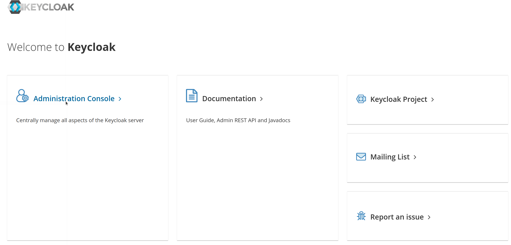
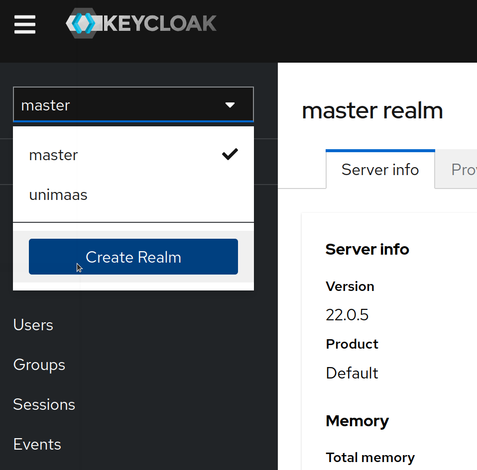
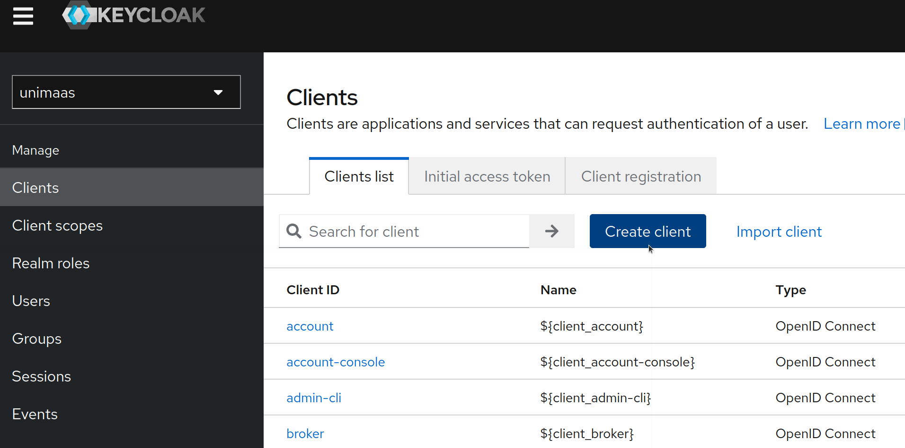
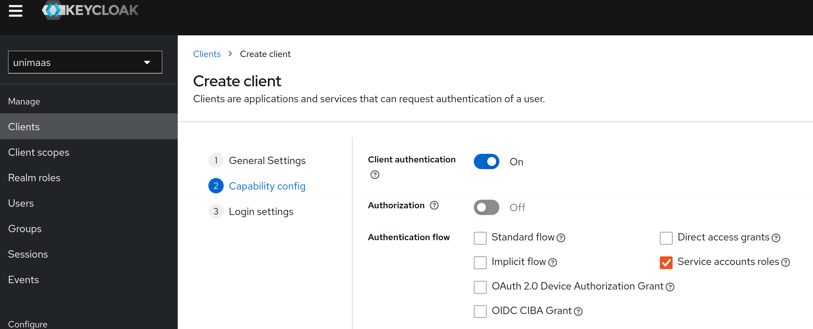
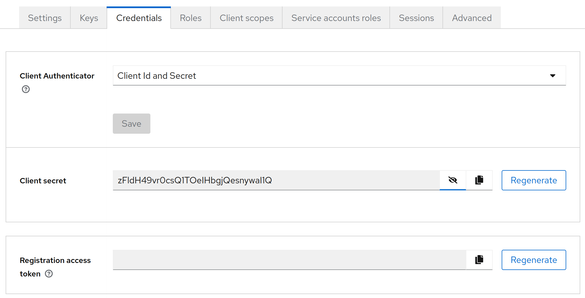

# KEYCLOAK - Deployment Steps

# 0 - Configuration

Configure `.env` file, define the administrator credentials.

# 1 - Deploy

```sh
cd tests/keycloak/; 
docker compose build; docker compose up -d
```

# 2 - LOGS Monitor

```sh
sleep 4; docker logs -f keycloak
```

# 3 - Create Client Keycloak

1. Access the website administration form (`http://localhost:5080`) using administrator credentials.



2. Once authenticated, create a `unimaas` realm.



3. `Create a client Since`: each client will be associated with a different Eclipse connector, it's a good idea to enter the connector's DID in both the `Client ID` and `Name` (for example: did:web:localhost%3A9876:connector1).



Access settings: 

- Client Authentication: ON 
- Authorization: OFF 
- Service Accounts Enabled: Marked 
- Rest Checks Unmarked



4. Once the client is created, access the "Credentials" tab where:
- Validate that: `Client Authenticator`="Client Id and Secret"
- Obtain the `Client secret` value, which will correspond to the value of the "CONNECTOR*_IDENTIHUB_UNIMAAS_OIDC_IDP_CLIENT_SECRET" variable that must be defined for the connector's identityHub.



**NOTE:** `Client ID` and `Client secret` will be configured for `ED-Node` instance (`UNIMAAS_OIDC_IDP_CLIENT_ID` and `UNIMAAS_OIDC_IDP_CLIENT_SECRET` parameters.

5. Once this is done, we can add a sample role associated with the application to see what ends up reaching the VC in IdentityHub when it starts. To do this, we either create the roles from the "Roles" tab or create them at the realm level. To assign roles to the client, go to the "Service Account Roles" tab of the corresponding client.


# 4 - Testing client

Once this is done we already have Keycloak configured and can obtain token with:

```sh
curl -X POST  
"<KeycloakProtocoll>://<KeycloakHost>:<KeycloakPort>/realms/<KeycloakRealm>/protocol/openid-connect/token" \
-H "Content-Type: application/x-www-form-urlencoded"   \
-d "grant_type=client_credentials&client_id=<clientID>&client_secret=<clientSecret>"
```

Obtaining:

```json
{ 
   "access_token":"eyJhbGciOiJSUzI1NiIsI....", 
   "token_type":"Bearer", 
   "not-before-policy":0, 
   "session_state":"1124351e-1c2a-43d1-83c6-5d6ad4134c87", 
   "scope":"email profile" 
}
```

Decipher `access_token` (jwt.io) and obtain the JWT info:

```json
{
    "exp":1757596908,
    "iat":1757596608,
    "jti":"02593986-1e8b-4d51-a705-dd9b303560eb",
    "iss":"http://localhost:5080/realms/unimaas",
    "aud":"account",
    "sub":"bf0d871a-be9f-4ef6-96bd-122638f6821b",
    "typ":"Bearer",
    "azp":"did:web:localhost%3A9876:connector1",
    "acr":"1",
    "allowed-origins":["/*"],
    "realm_access":{
        "roles":["offline_access","uma_authorization","default-roles-unimaas","realm-provider"]
    },
    "resource_access":{
        "did:web:localhost%3A9876:connector2":{
            "roles":["provider"]
        },
        "account":{
            "roles":["manage-account","manage-account-links","view-profile"]
        }
    },
    "scope":"profile email",
    "email_verified":false,
    "clientHost":"172.20.0.1",
    "preferred_username":"service-account-did:web:localhost%3a9876:connector1",
    "clientAddress":"172.20.0.1",
    "client_id":"did:web:localhost%3A9876:connector1"
}
```
